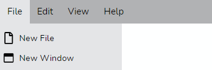

<div align="center">

  

  [](https://github.com/vinayakkulkarni/v-dock-menu/actions/workflows/ci.yml)
  [](https://deepscan.io/dashboard#view=project&tid=9055&pid=17446&bid=399662)
  [](https://deepsource.io/gh/vinayakkulkarni/v-dock-menu/?ref=repository-badge)
  [](https://lgtm.com/projects/g/vinayakkulkarni/v-dock-menu/context:javascript)
  [](https://snyk.io/test/github/vinayakkulkarni/v-dock-menu?targetFile=package.json)
  

  

</div>

<h2>Features</h2>

- ⚓ &nbsp;Dock your menu with ease.
- 🤏 &nbsp;Dock the Menubar by dragging and dropping to the edges of the screen.
- 👆 &nbsp;Touch support.
- 👍 &nbsp;Support for nested menus up to any levels.
- 👓 &nbsp; The Menus adjust to any docked position and enables an intuitive menu navigation.
- ⌨ &nbsp; Keyboard Accessible.
- 🎨 &nbsp; Icon support.
- ⚡ &nbsp; Zero dependencies.
- 💪 &nbsp; Built with [TypeScript](https://www.typescriptlang.org/).
- 🧰 &nbsp; Intuitive [API](#props) with data driven behavior.
- 🌠 &nbsp; Built with the all new [Composition API](https://github.com/vuejs/composition-api) for [Vue 2](https://vuejs.org/v2/guide/)
  
<h2>Table of Contents</h2>

- [⚡ Installation](#-installation)
- [🚀 Getting Started](#-getting-started)
- [Props](#props)
  - [⚓ Dock](#-dock)
  - [📡 on-selected](#-on-selected)
  - [⚡ Populating Menu](#-populating-menu)
  - [🎨 Custom color scheme](#-custom-color-scheme)
  - [🎭 Icon support](#-icon-support)
- [What's coming next](#whats-coming-next)
- [📦 Build Setup](#-build-setup)
- [🔨 Contributing](#-contributing)
- [🧱 Built with](#-built-with)
- [📜 Notes](#-notes)
- [Meta](#meta)

## ⚡ Installation

```sh
npm install v-dock-menu
```

## 🚀 Getting Started

`v-dock-menu` has some great defaults. Please check the [prop](#Props) section for all available options.

The following snippet creates a simple Menubar and docks it to the `top` of the page.

```sh
<template>
  <v-dock-menu :items="items">
  </v-dock-menu>
</template>

<script>
import { DockMenu } from "v-dock-menu";
import "v-dock-menu/dist/v-dock-menu.css";

export default {
  name: "example",
  components: {
    DockMenu
  },
  data() {
    return {
      items = [
        {
          name: "File",
          menu: [{ name: "Open"}, {name: "New Window"}, {name: "Exit"}]
        },
        {
          name: "Edit",
          menu: [{ name: "Cut"}, {name: "Copy"}, {name: "Paste"}]
        }
      ]
    }
  }
}
</script>
```


## Props

| Name        | Description                                                                                       | Default |
|-------------|---------------------------------------------------------------------------------------------------|---------|
| dock        | default docking position. Can be any one of `TOP`, `LEFT`, `RIGHT`, `BOTTOM` | `TOP`              |         |
| on-selected | Callback that will be called on a menu item selection                                             |         |
| items       | Data for the Menu bar                                                                             | []      |
| theme       | prop to customize the color theme                                                                 |         |
| draggable   | enables/disbales dragging on the menubar.                                                         | false    |

### ⚓ Dock

use the `dock` prop to dock the menubar to your preferred position. The prop can accept the following values `TOP`, `BOTTOM`, `LEFT`, `RIGHT`.

Here we dock the Menu bar to the right side of the screen.

```sh
<v-dock-menu>
  :items="items"
  dock="RIGHT"
</v-dock-menu>
```

### 📡 on-selected

The `on-selected` prop is used to retrieve the selected menu item. The callback receives an object with `name` and a `path` property.

- **name** - Name of the selected menu item.
- **path** - Full path of the selected menu item.

if you select the `Copy` menu item under the `Edit` menu, below would be the payload received on the `on-selected` callback.

```sh
{
  name: "Copy",
  path: "edit>copy"
}
```

### ⚡ Populating Menu

Use the `items` prop to create Simple or Nested menus of your liking.

Here we create a simple Menu structure with 3 Menu items with `Edit` and `Open Recent` having sub menus.

- To include a divider, set an empty item object with just a `isDivider` property set to `true`.
- To disable an item, set `disable` to `true`.

```sh
const items = [
  { name: "New" },
  { isDivider: true },
  {
    name: "Edit",
    menu: {
      name: "edit-items",
      disable:  true
    },
  },
  { isDivider: true },
  {
    name: "Open Recent",
    menu: {
      name: "recent-items",
    },
  },
  { isDivider: true },
  { name: "Save", disable: true },
  { name: "Save As..." },
  { isDivider: true },
  { name: "Close" },
  { name: "Exit" },
]
```

```sh
  <v-dock-menu>
    :items="items"
    dock="BOTTOM"
  </v-dock-menu>
```

### 🎨 Custom color scheme

use the `theme` prop to customize the colors of the menu bar.

```sh
  <menu-bar
    :items="items"
    :on-selected="selected"
    :theme="{
      primary: '#001B48',
      secondary: '#02457a',
      tertiary: '#018abe',
      textColor: '#fff'
    }"
  />
```


### 🎭 Icon support

Each menu item can be iconified and the component uses slots to inject the icons.

Pass individual icons (or images) as templates marked with a unique `slot id`. please make sure the `ids` match the  `iconSlot` property in the items array.

```sh
<menu-bar
  :items="items"
  :on-selected="selected"
>
  <template #file>
    
  </template>
  <template #window>
    
  </template>
</menu-bar>

export default defineComponent({
  name: "MenuExample",
  data()  {
    return {
      items: [
        { name: "New File", iconSlot: "file" },
        { name: "New Window", iconSlot: "window" },
      ]
    }
  }
})
```



This works seamlessly even for `nested` menu structure. Make sure the `slot ids` match and the component will render the icons appropriately.

```sh
<menu-bar
  :items="items"
  :on-selected="selected"
>
  <template #window>
    
  </template>
</menu-bar>

export default defineComponent({
  name: "MenuExample",
  data()  {
    return {
      items: [
        { name: "New File",
        subMenu: [{ name: "New Window", iconSlot: "window" }]},
      ]
    }
  }
});
```

## What's coming next

- Ability to position individual Menu Items
- Refactor using tailwind v2.x and remove all custom-css

## 📦 Build Setup

``` bash
# install dependencies
npm install

# start dev
npm run dev

# package lib
npm run rollup

# run css linting
npm run lint:css
```

## 🔨 Contributing

1. Fork it ( [https://github.com/vinayakkulkarni/v-dock-menu/fork](https://github.com/vinayakkulkarni/v-dock-menu/fork) )
2. Create your feature branch (`git checkout -b new-feature`)
3. Commit your changes (`git commit -am 'Add feature'`)
4. Push to the branch (`git push origin new-feature`)
5. Create a new Pull Request

## 🧱 Built with

- [TypeScript](https://www.typescriptlang.org/).

## 📜 Notes

This is a fork of the original [vue-dock-menu](https://github.com/prabhuignoto/vue-dock-menu) by [prabhuignoto](https://github.com/prabhuignoto) which supports Vue 2.
## Meta

Distributed under the MIT license. See `LICENSE` for more information.

[https://github.com/vinayakkulkarni/](https://github.com/vinayakkulkarni/)

[vue]: https://vuejs.org
[typescript]: https://typescriptlang.org
